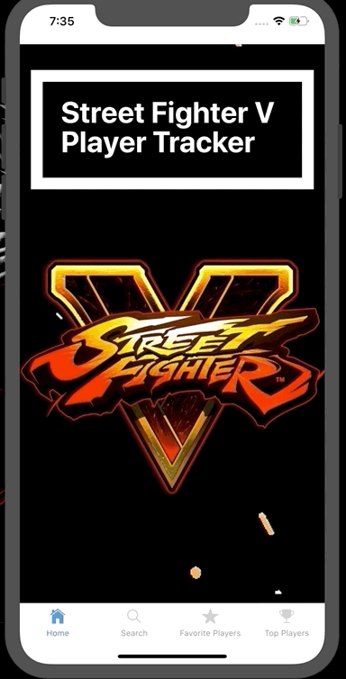

# Street Fighter V Player Tracker

#### Utilizing React Native / React Native Navigation this application hits an API to display stats about a searched player. The user then has the option to either store the player or search again.

> Users can access real-time lookups of any player's rank, points, Gamertag, and country if said player has entered any Capcom ranking event. 

> Users can also save their favorite players once they have found them. The saved players are stored by phone basis using local storage. 

## Installation
 
 There are 2 requirements for running this app.
   * [X-Code](https://medium.com/@LondonAppBrewery/how-to-download-and-setup-xcode-10-for-ios-development-b63bed1865c) must be installed to use the IOS simulator.
   * [Expo](https://expo.io/learn) must be installed to use with the simulator.
 
 Clone the repo down to your local machine.
 
    git clone https://github.com/bruceferguson3/Street-Fighter-V-Fighter-Tracker.git
    
 Use the package manager [npm](https://www.npmjs.com/get-npm) to install Expo.
    
    npm install
    
 Run Expo
 
    expo start -ios           

## Usage

> Users will always be able to view the top ranking players for Street Fighter V by navigating to `Top Players`

#### 

> Users can search for their favorite players and have the option of either saving them or searching for another player. 
>
>If the player is saved, he/she goes to the `Favorite Players` tab. 
>
>From the `Favorite Players` tab there are a few options...
> * Deleting a player: Simply click on the player and the user will be prompted with a `Are you sure?` message.
> * Deleting all players: Click the `Clear all saved players` button and the will be prompted once again `Are you sure?` 
>
>   - *WARNING all players saved will be deleted.*

#### 

## Running Tests

TODO: Write Test Examples

## Message to the User

#### Thank you for using my application! 

> I designed this application to help keep track of players that are competing for points. It's a great way to spark competition between players!
>
> Fight well, stay competitive! :punch: 

## Contributing

  * Fork it! 
  * Create your feature branch: `git checkout -b my-new-feature` 
  * Commit your changes: `git commit -am 'Add some feature'` 
  * Push to the branch: `git push origin my-new-feature`
  * Submit a pull request!